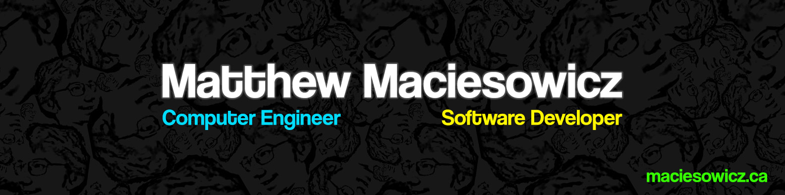

## Hi, I'm Matthew 👋

Hello! I'm a Computer Engineering student and software developer passionate about **AI**, **software engineering**, **web development**, and solving complex problems. Some technologies I enjoy working with include Python, C/C++, ReactJS/NextJS.

Check out my projects, and feel free to contribute!

<!--
**mmaciesowicz/mmaciesowicz** is a ✨ _special_ ✨ repository because its `README.md` (this file) appears on your GitHub profile.

Here are some ideas to get you started:

- 🔭 I’m currently working on ...
- 🌱 I’m currently learning ...
- 👯 I’m looking to collaborate on ...
- 🤔 I’m looking for help with ...
- 💬 Ask me about ...
- 📫 How to reach me: ...
- 😄 Pronouns: ...
- ⚡ Fun fact: ...
-->
